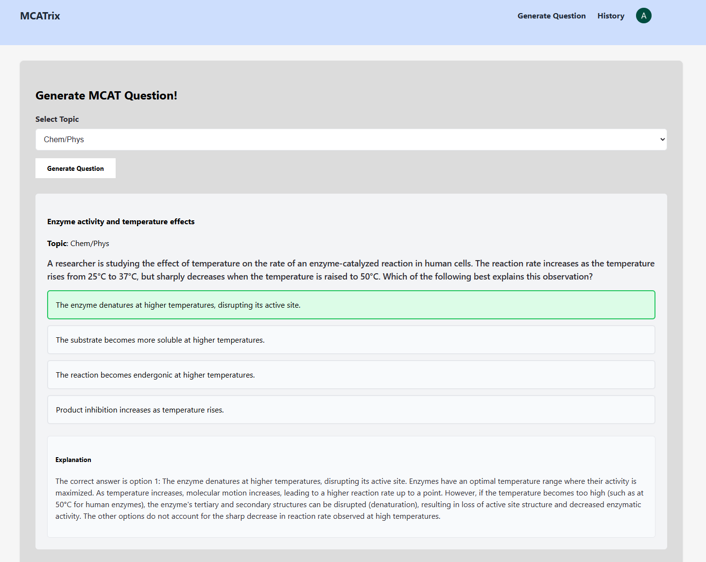
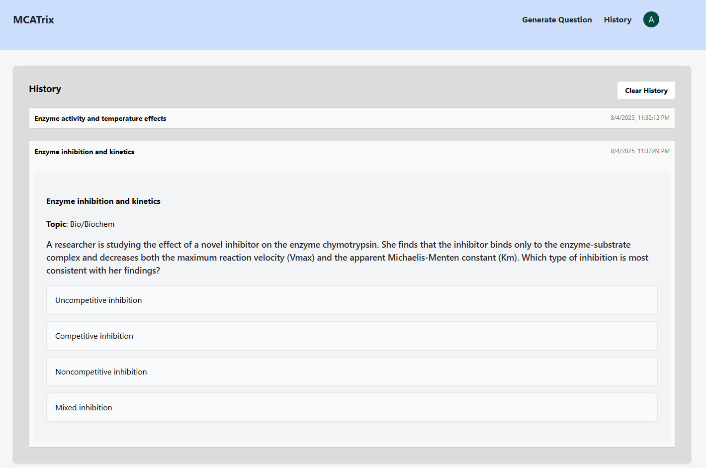

# MCATrix

MCATrix is a web application that helps users practice for the Medical College Admission Test (MCAT). The application generates sample practice questions using the OpenAI API. 
Users can also view previously generated questions that are stored in a PostgreSQL database. 
The app is hosted on AWS and uses Caddy as a reverse proxy.

Address: http://44.201.150.219/ 
(Backend is currently disabled but can be re‑enabled for demonstrations.)

### Images:

| Landing Page | Question History |
|--------------|------------------|
|  |  |

### Tech Stack:

- **Frontend:** React, Clerk
- **Backend:** Python, FastAPI, SQLAlchemy, OpenAI API, Astral Docs
- **Database:** PostgreSQL
- **Hosting:** AWS, Ubuntu, Caddy

### Key Dependencies
- Python 3.12+
- FastAPI
- SQLAlchemy
- psycopg2-binary
- OpenAI API client
- Astral Docs
- Node.js 20+
- React
- Clerk
- Vite
- PostgreSQL 15+
- Caddy

### Running locally
After downloading the above dependencies:
##### Frontend
Have a ```.env``` file to store a Clerk key as an environment variable: ```VITE_CLERK_PUBLISHABLE_KEY=...```

To start frontend:

```cd ../frontend```

```npm run dev```

Frontend will be available at: http://localhost:3000

##### Backend
Have a ```.env``` file to store the following environment variables: 

```CLERK_SECRET_KEY=...```

```JWT_KEY=...```

```OPENAI_API_KEY=...```

```POSTGRESQL_PW=...```

To start backend:
```cd ../backend```
```uv run server.py```